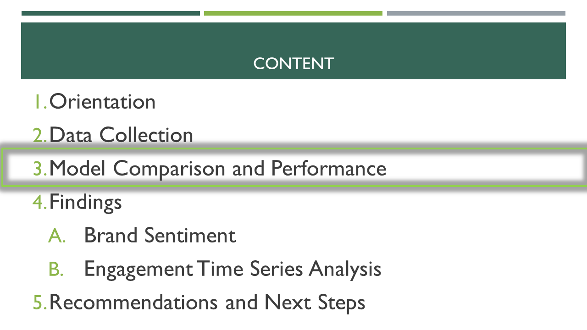
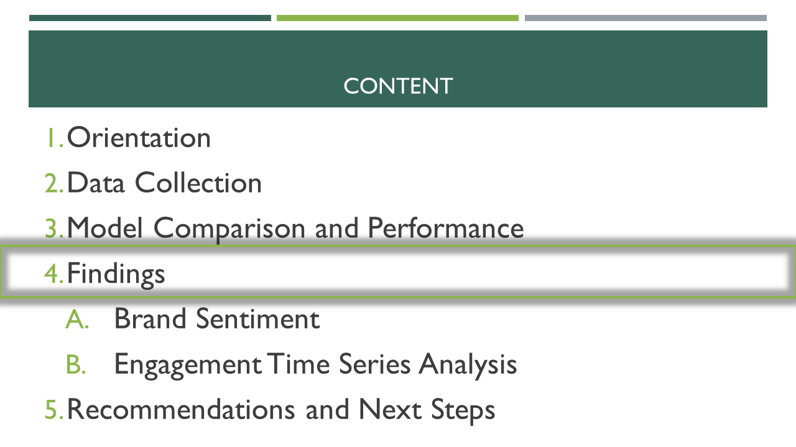
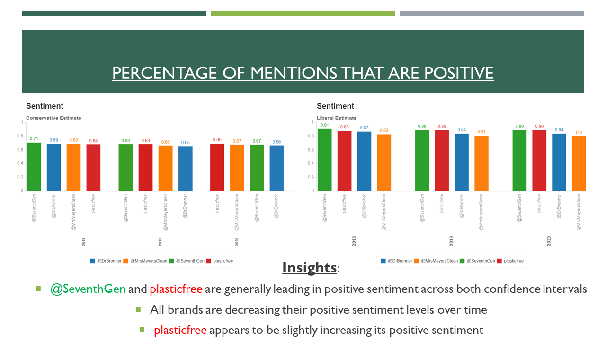

# Household-CPG-Sentiment-Analysis

---
## Table of Contents:
[1.0 Directory Structure](#10-directory-structure)<br>
[2.0 Orientation](#20-orientation)<br>
[3.0 Software APIs Libraries Used](#30-software-apis-libraries-used)<br>
[4.0 Data Dictionary](#40-data-dictionary)<br>
[5.0 High Level Overview of Findings](#50-high-level-overview-of-findings)<br>
[6.0 Minimum Viable Product for Web Application](#60-minimum-viable-product-for-web-application)<br>
[7.0 Next Steps and Recommendations](#70-next-steps-and-recommendations)<br>
[8.0 Sources and Citations](#80-sources-and-citations)<br>
[9.0 Contact Info](#90-contact-info)<br>

---
## 1.0 Directory Structure
```
├── Household-CPG-Sentiment-Analysis
    ├── visuals
    ├── eddi_findings.pdf
    ├── README.md
    ├── initial_imports_cleaning_engineering.ipynb
    ├── master_df.csv
    ├── bar.ipynb
    └── foo.ipynb
```    
## 2.0 Orientation

#### 2.1 Hypothesis


## 2.2 Executive Summary


## 2.3 Objectives


## 2.4 KPIs


## 2.5 Brands Examined


## 3.0 Software APIs Libraries Used

#### 3.1 Data Engineering, Analysis, and Collection
- Python3
- Jupyter
- Atom
- GetOldTweets3
- Pandas
- Numpy
- Dill

#### 3.2 Natural Language Processing (NLP) Preprocessing and Modeling
Text Preprocessing
- TFIDF Vectorizer (Best Param)
- Count Vectorizer
- NLTK
- Spacy
NLP Sentiment Analysis Models
scikit-learn
- Support Vector Machine (Best Param)
- Random Forest
- Multinomial Naïve Bayes
TensorFlow (Keras)
- Recursive Neural Network
vaderSentiment
- Sentiment Analyser

#### 3.3 Visuals
- Chartify
- Bokeh
- Matplotlib: Pyplot
- Seaborn
- Missingno
- Microsoft PowerPoint
- Adobe Acrobat

## 4.0 Data Dictionary

| Column | Description |
| --- | --- |
| **Zip** | Zip Code. |
| **Pop Rank** | Ordinal population size. 1 is the largest populated zip code, 2 is the second largest. |
| **XXXX Mean Median** | The aggregated average annual sale price from the zip code median sale prices. |
| **Hurricane Affected** | 1 if the zip code was impacted by Hurricane X according to FEMA, 0 otherwise. |
| **% Change After Hurricane** | Percentage difference in median zip sale price comparing the month preceding the storm to the month following the storm.|

## 5.0 Overview of Findings

### 5.1 Data Collection


#### 5.2 Model Camparison and Performance


### 5.3 Support Vector Machine Results




## 5.4 Enagement Time Series Analysis


## 5.5 Brand and Consumer Sentiment Analysis



## 6.0 Next Steps and Recommendations


## 7.0 Sources and Acknowldgements
1. <a href="https://www.zillow.com/research/data/">Zillow Median Sale Price by Zip (CSV)</a>

2. <a href="https://www.zillow.com/browse/homes/tx/harris-county/">Zillow: Harris County, TX Zip Codes</a>

## 8.0 Contact Info
Robert Becotte - email: robert.becotte@gmail.com , github: robertgerardb <br>
