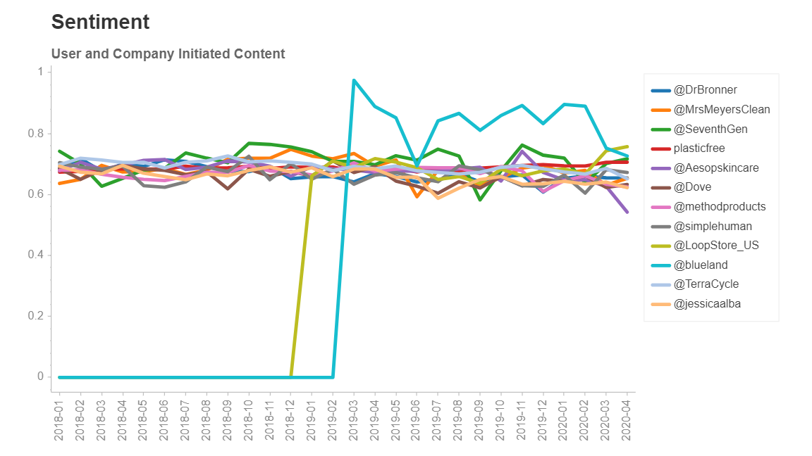
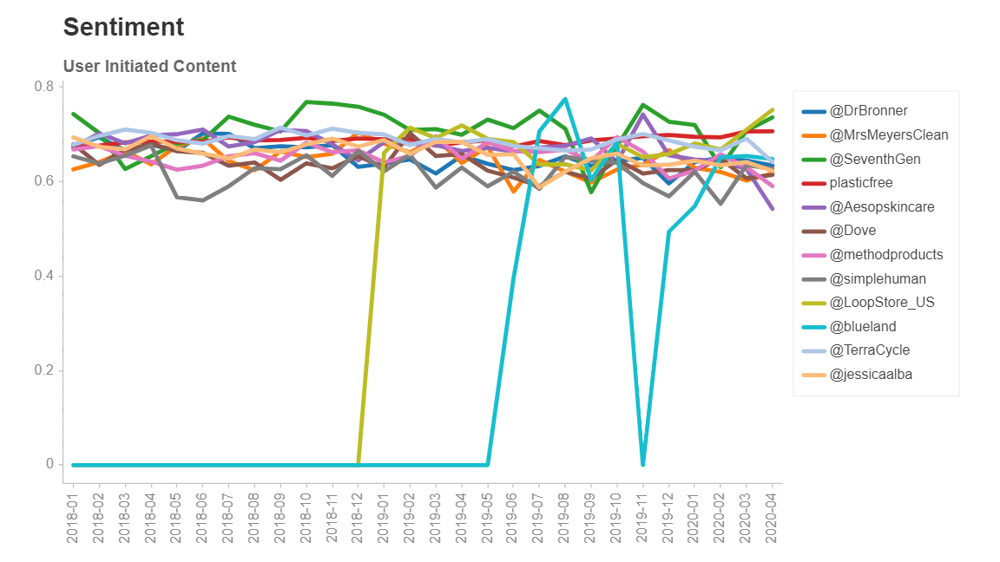
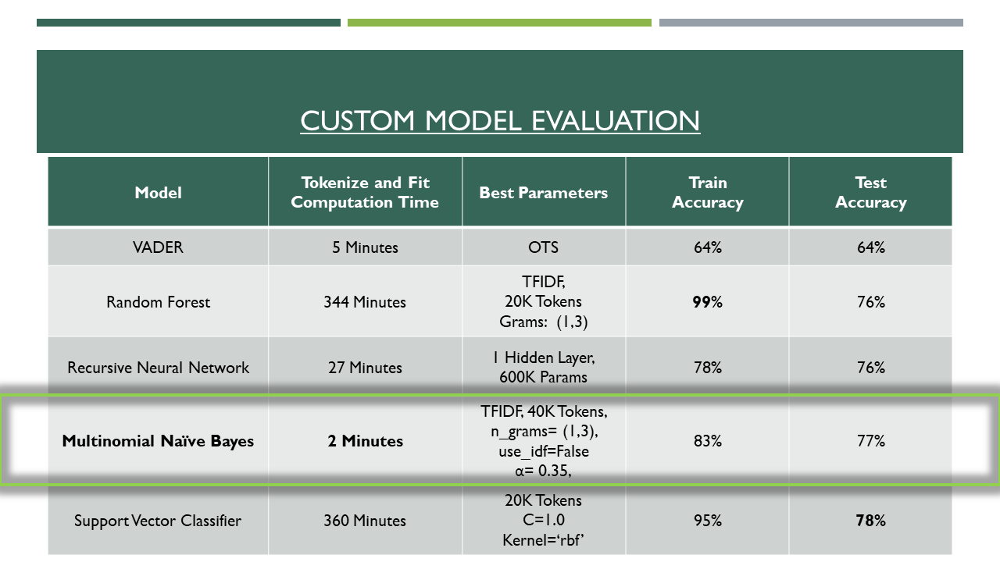
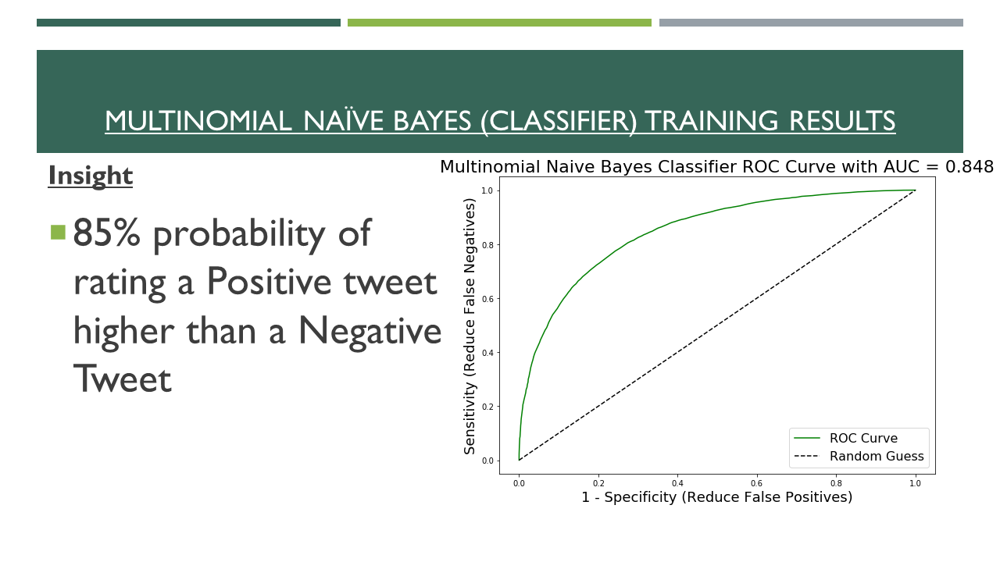
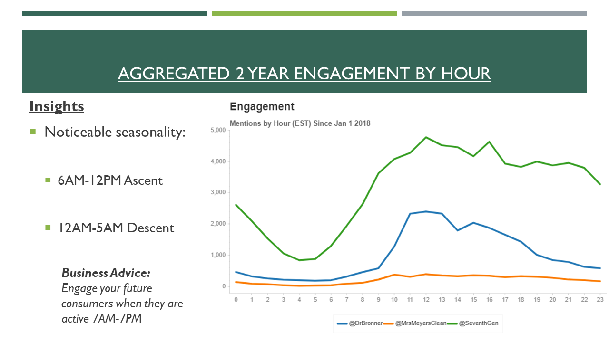
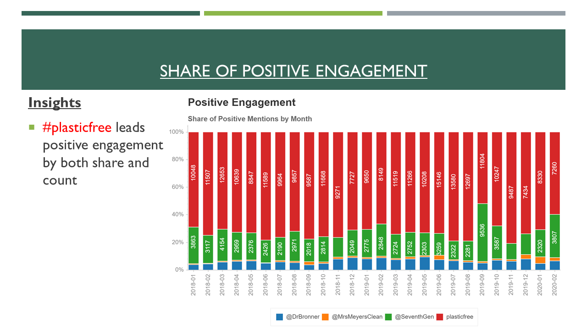

# Household-CPG-Sentiment-Analysis
### This is an active repo. Best classifier to date is the Multinomial Naïve Bayes model. Complete findings of iteration 1 in the pdf, highlights below.

### Last Update: 4/24/20
#### Latest update includes a truncated pdf slide deck comparing sentiment between user and company generated content

#### These changes exploring other brands to gain more confidence in sentiment of sector space

#### There appears to be a dip in user generated consumer household CPG sentiment since the pandemic. Teaser (incomplete) visuals directly below, before Table of Contents


#### Company generated content brings up sentiment scores as expected.




---


---
## Table of Contents:
[1.0 Directory Structure](#10-directory-structure)<br>
[2.0 Orientation](#20-orientation)<br>
[3.0 Software APIs Libraries Used](#30-software-apis-libraries-used)<br>
[4.0 Overview of Findings](#40-overview-of-findings)<br>
[5.0 Next Steps and Recommendations](#50-next-steps-and-recommendations)<br>
[6.0 Sources and Acknowledgements](#60-sources-and-acknowledgements)<br>
[7.0 Contact Info](#70-contact-info)<br>

---
## 1.0 Directory Structure
```
├── Household-CPG-Sentiment-Analysis/
    ├── jupyter_nb/
          ├── mnb_nb/
            ├── 04_eddi_mnb.ipynb
            ├── 05_applying_mnb_twitter_scraped.ipynb
            └── 09_visuals_tenBrand
          ├── svm_nb/
            ├── 16_vader_experiment__kaggle_twitter_reddit_01.ipynb
            ├── 19_twitter_kaggle_model_train_test.ipynb
            ├── 21_modeling_unseen_twitterdata_01.ipynb
            ├── 22_confusion_matrix_SVM_training_data.ipynb
            └── 23_sentiment_unseen.ipynb
    ├── visuals/
    ├── .gitignore
    ├── README.md
    ├── findings_v6.pdf
    └── truncated_findings_09.pdf
```    
## 2.0 Orientation

### 2.1 Hypothesis


### 2.2 Executive Summary


### 2.3 Brands Examined

---
## 3.0 Software APIs Libraries Used

### 3.1 Data Engineering, Analysis, and Collection
- Python3
- Jupyter
- Atom
- GetOldTweets3
- Pandas
- Numpy
- Dill

### 3.2 Natural Language Processing (NLP) Preprocessing and Modeling
#### Text Preprocessing
- TFIDF Vectorizer (Best Param)
- Count Vectorizer
- NLTK
- SpaCy
#### NLP Sentiment Analysis Models
1. scikit-learn
- Support Vector Machine
- Random Forest
- Multinomial Naïve Bayes
2. TensorFlow (Keras)
- Recursive Neural Network
3. vaderSentiment
- Sentiment Analyser

### 3.3 Visuals
- Chartify
- Bokeh
- Matplotlib: Pyplot
- Seaborn
- Missingno
- Microsoft PowerPoint
- Adobe Acrobat
---
## 4.0 Overview of Findings

### 4.1 Data Collection


### 4.2 Model Comparison and Performance


### 4.3 Multinomial Naïve Bayes Classifier Results




### 4.4 Engagement Time Series Analysis




### 4.5 Brand and Consumer Sentiment Analysis



---
## 5.0 Next Steps and Recommendations

---
## 6.0 Sources and Acknowledgements
1. <a href="https://sproutsocial.com/insights/twitter-mentions/">Social Media Metrics</a>

2. <a href="http://nlpprogress.com/english/sentiment_analysis.html">Machine Learning NLP Sentiment Analysis Benchmarks</a>

3. <a href="https://pdfs.semanticscholar.org/d0a5/21c8cc0508f1003f3e1d1fbf49780d9062f7.pdf">Twitter Sentiment Analysis Benchmarks</a>

4. <a href="http://twitter.com>NLP Sentiment Analysis Benchmarks">Twitter</a>

5. <a href="https://towardsdatascience.com/how-to-scrape-tweets-from-twitter-59287e20f0f1">GOT3 Code Example</a>

6. <a href="https://towardsdatascience.com/machine-learning-for-text-classification-using-spacy-in-python-b276b4051a49">NLP and SpaCy Tips</a>

6. <a href="https://registry.opendata.aws/">Amazon Training Dataset</a>

6. <a href="https://www.kaggle.com/c/twitter-sentiment-analysis2/data">Kaggle Training Dataset</a>
---
## 7.0 Contact Info
Robert Becotte - email: robert.becotte@gmail.com , github: robertgerardb <br>
